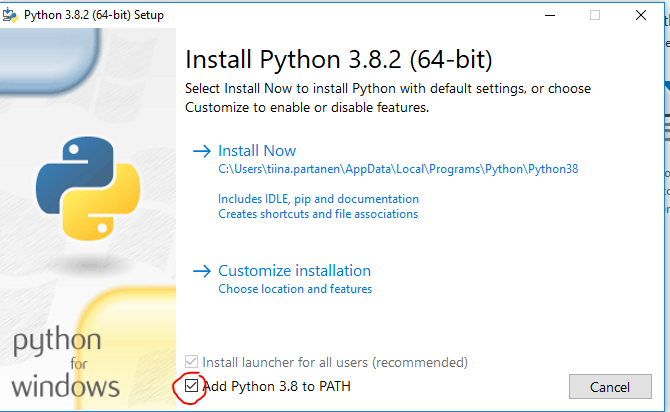
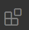
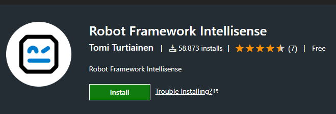
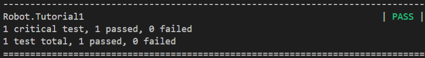

## Robot framework

### Asennus

Testaa onko koneellasi asennettuna Python. Avaa CMD:

```cmd
> python --version
```

Jos ei asennna se:

- Asenna [Python 3.8.x](https://realpython.com/installing-python/#step-1-download-the-python-3-installer)
--> [windows64-installation](https://www.python.org/ftp/python/3.8.2/python-3.8.2-amd64.exe)

- Lisää Python myös polkuun (ympäristömuuttujat: PATH)



- Käynnistä kone uudelleen

- Avaa CMD, asenna robotframework (pip tulee Pythonin mukana):

```cmd
> pip install robotframework
```

Asenna myös Selenium-kirjasto:

```cmd
> pip install --upgrade robotframework-seleniumlibrary
```

Asenna webdriver (vaatii Chromen):

```cmd
> pip install webdrivermanager
webdrivermanager chrome
```

HUOM! Lataa Chrome-versioosi kuuluva webdriver [täältä](https://chromedriver.chromium.org/downloads), tallenna se c:\bin kansioon ja lisää se PATH:hiin.

Asenna Robotframework - lisäosa VSCode:een (valitse lisäosat):<BR>



---
Asennusohje-video:
[Asennusohje](https://ohjelmistotestaus.fi/2019/12/18/robot-framework-asennus/)

### Tutoriaali

 Liitä tämä [koodi](https://gist.github.com/laojala/b20e9fe041d4452dd0c409a9c3be9ebe) tiedostoon, jonka nimi on "tutorial1.robot" ja aja se terminaalissa siirtymällä ko. kansioon ja kirjoittamalla:

```cmd
> robot .
```

Testi käynnistää Chrome-selaimen ja avaa sivun *[http://prove.fi](http://prove.fi)*.
Testi *fail*:aa, sillä sivulla ei lue "SAA DEVAUKSESTA 30% ENEMMÄN IRTI". Muokkaa testiksi:

```robot
*** Settings ***

Library         SeleniumLibrary

Suite Setup     Open Browser     https://www.prove.fi/   Chrome
Suite Teardown  Close Browser

*** Test Cases ***

Verify Header Text Exists
    Wait Until Page Contains    ENTÄ, JOS VOISIT PUOLITTAA TULIPALOT JA TUPLATA DEVAUSTEHOT
```

Nyt testi onnistuu:

