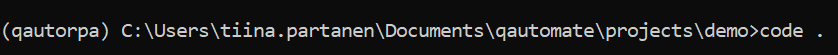
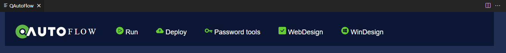
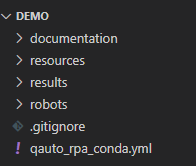
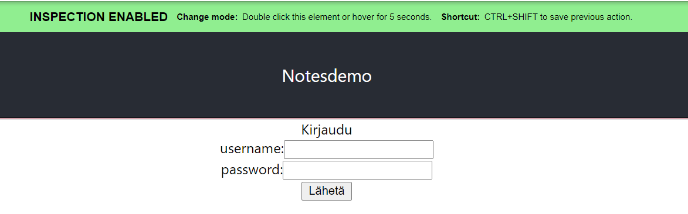
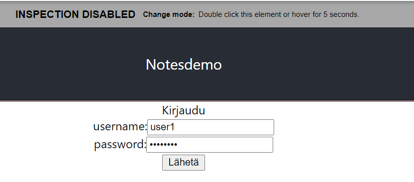
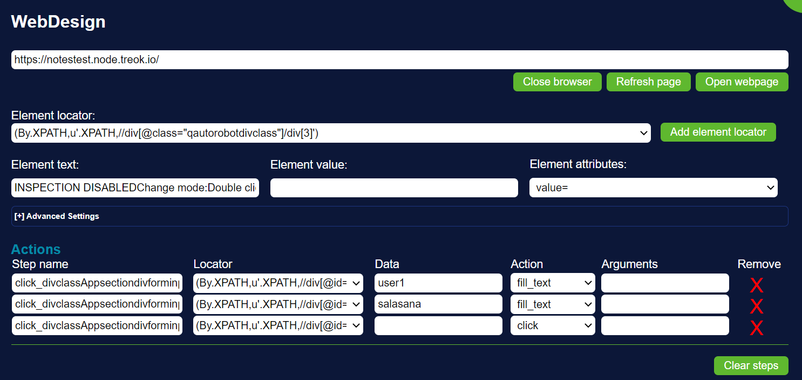
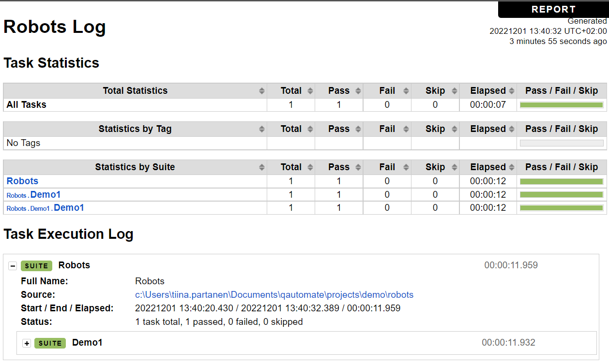

## Ohjelmistorobotiikka, QAutomate - demo 

### Taustaa

Tutustumme ohjelmistorobotiikkaan QAutoFlow - ohjelman avulla. QAutoFlow on QAutomate:n työkalu, joka integroituu VSCode:een. Sen avulla voi rakentaa kätevästi ohjelmistorobotin, joka suorittaa sille määritellyt tehtävät itsenäisesti. Ohjelmistorobotti pystyy syöttämään käyttöliittymään sille annetut tiedot, painamaan nappeja sekä navigoimaan sivulla, eli toimimaan ihmisen sijaisena tylsissä ja tarkkuutta vaativissa rutiinitehtävissä. Robotille pitää opettaa/näyttää miten toiminta tehdään, jotta se voi toimia. 

Ohjelmistorobotiikka hyödyntää RobotFramework:ia, johon voidaan ohjemoida toimintoja mm. Python-ohjelmointikielellä. Kun tehdään ohjelmistorobottia web-käyttöliittymälle, käytetään lisäksi *headless browser* - teknologiaa (*Selenium*-kirjasto). *Selenium*:in avulla voidaan syöttää web-sivulle ohjelmallisesti esim. tekstiä *input*-kenttiin painaa *login*-painiketta jne.

Tässä demossa et tarvitse paljon Python-osaamista.

### Asennus

1. Asenna opettajan ohjeiden mukaisesti *QAutoFlow*-ohjelma sekä Python ympäristö [*Miniconda3*](https://docs.conda.io/en/latest/miniconda.html). Valitse asennuksessa (Advanced Options): *Add to path*. Tarkista myös, että koneella on asennettuna *node.js*. 

2. Luo Documents:in alle kansio *RPA_projects\demo*. Tallenna sinne opettajan antama *qauto_rpa_conda.yml* - tiedosto.

3. Avaa CMD ja siirry em. kansioon, aktivoi *conda*-ympäristö:

    ```cmd
    conda env create -n qautorpa --file qauto_rpa_conda.yml
    conda activate qautorpa
    ```

4. Asenna Playwright:in vaatimat modulit:

    ```cmd
    python -m Browser.entry init
    ```

5. Avaa VSCode tässä kansiossa:

    ```cmd
    code .
    ```

    Ympäristö on kunnossa, jos se näyttää tältä:

    

### Robotin luominen

1. Avaa QAutoFlow-välilehti VSCodesta (sivun yläreunan päällä hiiren oikea-nappi -> Start QAutoFlow)

    

2. Valitse *Run* ja *Create RPA Project*, anna projektille nimi (Iso alkukirjain, ei välilyöntejä, ei skandeja, esim. Demo1)

    

3. Käynnistä robotin "opettaminen", valitse -> *WebDesign* ja syötä testisivun URL:

    ```cmd
    https://notestest.node.treok.io/
    ```

4. Valitse -> *Open webpage*, sivu avautuu selaimeen ja QAutoFlow-ohjelma poimii tekemäsi operaatiot koodiksi (kunnes tuplaklikkaat vihreää palkkia). 

    

5. Valitse hiirellä *username*-kenttä ja kirjoita siihen: *user1* + tallenna painamalla Ctrl+Shift, valitse sitten *password*-kenttä ja kirjoita siihen *salasana*, tallenna painamalla Ctrl+Shift, lopuksi paina *Lähetä* ja tallenna painamalla Ctrl+Shift. Poista nauhoitus tupla-klikkaamalla vihreää palkkia ja kirjaudu nyt oikeasti.

    

6. Jos tallentaminen onnistui, robottivälilehdelle ilmestuu kolme *actions step*:iä. Muuta kahden ensimmäisen action:in tyyppi *fill_text*:ksi, ja lisää Data-kenttään kirjautumistiedot. Nyt sivun pitäisi näyttää tältä:

    

7. Anna komponentille nimi ja tiedoston nimi ja tallenna valitsemalla -> *Create Keyword*. Nyt tyhjennä actions-lista (punainen rasti) ja nauhoita logout.  Tallenna kuten edellä (Ctrl+Shift), valitse komponentin nimeksi Logout, ja tiedoston nimeksi Logout.py.

8. Nyt kirjoitetaan robotframework-koodi, joka kutsuu edellä luotuja Login- ja Logout-komponentteja.

9. Avaa VSCode:ssa tiedosto: robots/Demo1.robot ja lisää siihen seuraavat rivit:

    ```cmd
    new page windowed    https://notestest.node.treok.io/
    Log Data    title=Etusivu  msg=Avattiin etusivu
    Login    user1    salasana
    Log Data    title=Kirjautuminen  msg=Kirjauduttu sisään
    Sleep    5
    Logout
    Log Data    title=Loppu  msg=Robotti ajettu onnistuneesti
    ```

### Robotin ajaminen

1. Nyt ajetaan robotti. Valitse QAutoFlow-välilehdeltä -> *Run* ja *Local run*. Jos kaikki menee ok, pitäisi ruudulla näkyä kolme kertaa *PASS*. 

    

    Voit myös katsella log.html-tiedostoa.

    

2. Jos käytössäsi on QAutoFlow:in serveri, voit tehdä robotista \*.zip tiedoston ja ladata sen serverille ajettavaksi -> *Deploy* -> *Server settings* -> *Deploy QAutoCloud*. Serverillä on helppoa kontrolloida robotin toimintaa ja seurata raportteja. 

--- 

## Tehtävä 1

Tee ohjelmistorobotti, joka testaa jotakin tekemääsi ohjelmaa, joka löytyy netistä. Ohjelma voi olla esim. notesdemo2 tai jokin projektityö. Palauta robotti koodi \*.zip - filenä systeemityön repoon.

## Tehtävä 2

Aja edellä tekemääsi testirobottia docker-compose:n avulla ([ohjeet](../docker/rpa.html).

