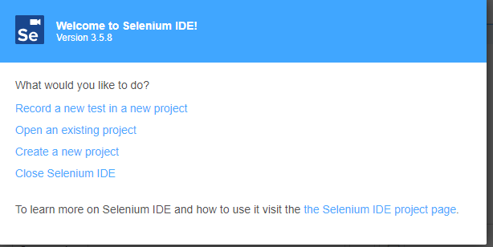
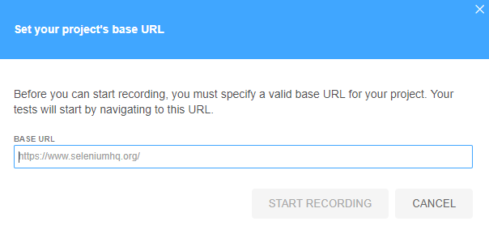
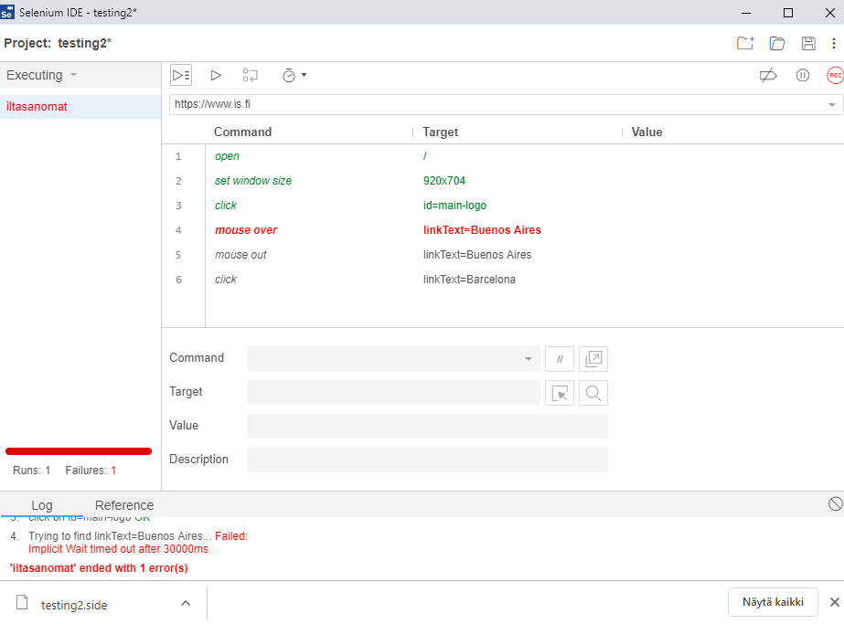

## Selenium IDE

Selenium IDE on selaimeen lisättävä plug-in, jonka avulla voi nauhoittaa käyttäjän toimintaa selaimessa. Sen avulla voidaan siis tallentaa automatisoituja testisekvenssejä ja ajaa niitä mm. regressiotestausta tehtäessä.

### Selenium IDE:n asennus Chromeen

Asenna Selenium IDE Chrome-selaimeen [täältä](https://chrome.google.com/webstore/detail/selenium-ide/mooikfkahbdckldjjndioackbalphokd).

### Testaus Selenium IDE:n avulla

Avaa Selenium IDE selaimen oikeasta yläkulmasta (Se-ikoni).

Luo uusi testi: "Record a new test in a new project". Anna sille nimi sekä "base url" eli testattavan sivuston osoite, josta testit aloitetaan.

Nyt Selenium nauhoittaa kaikki toimintasi sivustolla. Voit pysäyttää nauhoituksen Selenium-ikkunan "stop"-napista. Nauhoituksen voi tallentaa ja ajaa uudelleen. Testitulokset näyttävät tältä:

### Harjoitus

Testaa omaa sivustoasi Selenium IDE:n avulla. Nauhoita muutama manuaalisesti tekemäsi testitapaus. Huomaa, että kaikki testitapaukset eivät sovellu automatisoitaviksi Selenium IDE:n avulla.