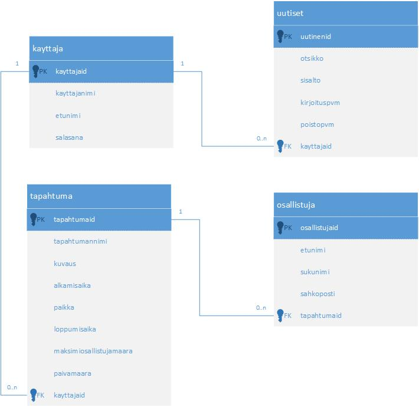

## Tietokantojen suunnittelu

### ER-malli (Chen)

ER-mallin avulla mallinnetaan ohjelmiston tarvitsevat tiedot ja niiden suhteet.

ER-malli esimerkki

Tutustu tarkemmin ER-mallintamiseen:

- [ER-malli](http://appro.mit.jyu.fi/tiedonhallinta/luennot/luento2/#TOC1)

- [ER-diagrams](https://creately.com/blog/diagrams/er-diagrams-tutorial/)

### Tietokantakaavio (UML)

ER-mallin avulla luodaan tietokannan rakennetta kuvaava tietokantakaavio. Tietokantakaavioita on erilaisia (Crows foot, UML). Tässä UML-tietokantakaavioesimerkki:

