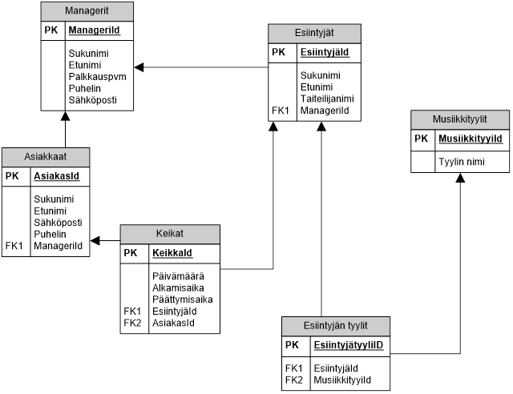

## Tietokannat

### Lämmittely

1. Ensin itsearviointia opintojakson aluksi: Miten hyvin mielestäsi nyt osaat tietokanta-asiat (Access, terminologia, SQL)?
2. Mikä on pääavain (Primary Key) ja mikä on sen merkitys relaatiotietokannoissa?
3. Mikä on viiteavain eli vierasavain (Foreign Key) ja mikä on sen merkitys relaatiotietokannoissa?
4. Piirrä, miltä relaatiotietokanta mielestäsi näyttää. Tee sellainen piirros, jonka avulla voisit selittää relaatiotietokannan rakenteen ”ummikolle”. Tarkoitus on, että teet piirroksen itse, etkä kopioi netistä etkä mistään muualtakaan. Nimeä kuvaan tietokantoihin liittyvät termit: taulu, tietue, pääavain, viiteavain
5. Mikä on indeksi?
6. Miksi Opiskelija-taulukon pääavaimena sukunimi ei ole hyvä?

Vastaa Word-dokkariin, palauta Github-classroomiin.

### Alkutoimet

Käynnistä MySQL-serveri ja PHPMyAdmin, jos tietokoneeseen ne on asennettuna (XAMPP). Jos ei ole käynnistä ne Dockerin avulla [ohje](../docker/index.html).

### Tietokannan luominen (PHPMyAdmin)

1. Tee oheisen tietokantamallin mukainen tietokanta PHPMyAdmin-ohjelmalla. Anna tietokannalle nimeksi "musicdb".

Tallenna tietokannan rakenne: Export-toiminnon avulla ja palauta Github-classroomiin.

2. Syötä testitietoa (vähintään kolme manageria, esiintyjää, musiikkityyliä, asiakasta sekä yksi mennyt keikka sekä yksi tuleva keikka per esiintyjä).

Tallenna tietokannan tiedot: Export-toiminnon avulla ja palauta Github-classroomiin.

### Tietokannan testaaminen (PHPMyAdmin)

1. Tee kysely, jonka avulla saat selville kaikkien managerien tiedot nimien mukaisessa aakkosjärjestyksessä (sukunimi ensisijainen ja etunimi toissijainen lajittelukenttä).
2. Tee kysely, jolla saat selville kaikkien esiintyjien menneet keikat. Kyselyn tuloksessa pitää näkyä myös esiintyjien nimet.
3. Tee kysely, jonka avulla saat selville kaikki rokkariesiintyjät. Huom! Rock on musiikkityylin nimi.
4. Tee kysely, jonka avulla saat selville, kuinka monta asiakasta tietokannassa on.
5. Tee kysely, jonka avulla saat selville, kuinka monta asiakasta kullakin managerilla on.
6. Millaisella kyselyllä saat lisättyä tietokantaan uuden keikan?
7. Millaisella kyselyllä saat poistettua tietokannasta tietyn nimisen asiakkaan?
8. Millaisella kyselyllä saat muutettua tietyn nimisen managerin puhelinnumeron?

Palauta SQL-lauseet tiedostona Github-classroomiin.