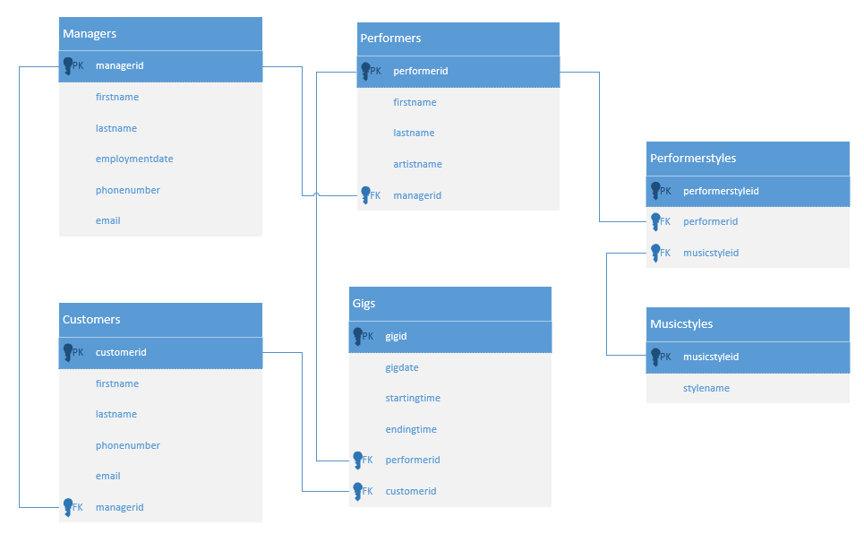

## Tietokannan luominen ja käyttäminen hallintaohjelmalla (musicdb)

### Alkutoimet

Käynnistä MySQL ja PHPMyAdmin Dockerin avulla [ohje](../docker/index.html).

### Tietokannan luominen (PHPMyAdmin)

1. Tee oheisen tietokantamallin mukainen tietokanta PHPMyAdmin-ohjelmalla. Anna tietokannalle nimeksi "musicdb".

Tallenna tietokannan rakenne: Export-toiminnon avulla ja palauta Github-classroomiin.

2. Syötä testitietoa (vähintään kolme manageria, esiintyjää, musiikkityyliä, asiakasta sekä yksi mennyt keikka sekä yksi tuleva keikka per esiintyjä).

Tallenna tietokannan tiedot: Export-toiminnon avulla ja palauta Github-classroomiin.

### Tietokannan testaaminen (PHPMyAdmin)

1. Tee kysely, jonka avulla saat selville kaikkien managerien tiedot nimien mukaisessa aakkosjärjestyksessä (sukunimi ensisijainen ja etunimi toissijainen lajittelukenttä).
2. Tee kysely, jolla saat selville kaikkien esiintyjien menneet keikat. Kyselyn tuloksessa pitää näkyä myös esiintyjien nimet.
3. Tee kysely, jonka avulla saat selville kaikki rokkariesiintyjät. Huom! Rock on musiikkityylin nimi.
4. Tee kysely, jonka avulla saat selville, kuinka monta asiakasta tietokannassa on.
5. Tee kysely, jonka avulla saat selville, kuinka monta asiakasta kullakin managerilla on.
6. Millaisella kyselyllä saat lisättyä tietokantaan uuden keikan?
7. Millaisella kyselyllä saat poistettua tietokannasta tietyn nimisen asiakkaan?
8. Millaisella kyselyllä saat muutettua tietyn nimisen managerin puhelinnumeron?

Palauta SQL-lauseet tiedostona Github-classroomiin.

### UML-luokkakaavio tietokantamallina

Harjoittele Vision UML-työkalun käyttämistä ja tee oheinen tietokantakuva itse. UML-mallissa laatikot mallintavat luokkia (ja tietokannan ollessa kyseessä tauluja). Luokilla voi olla erilaisia yhteyksiä toisiinsa (relaatioita). Jos kahden asian (luokan) välillä on tavallinen relaatio, se merkitään viivalla ja asiaankuuluvilla lukumäärillä molemmissa viivan päissä. Jos asia (luokka) koostuu muista luokista se merkitään salmiakilla. Salmiakki on musta, jos määrä on täsmälleen yksi, valkoinen, jos sallitaan vaihteleva määrä jäseniä (0..n tai 0..1). Ääretön määrä merkitään siis *n*-kirjaimella.

Lisää UML-kuvaan relaatioihin liittyvät lukumäärää ilmoittavat merkinnät (1, 0..1 tai 0..n) sekä relaation tyyppiin (viiva, musta tai valkoinen salmiakki) liittyvät merkinnät.

- [Database Modeling in UML](https://www.eetimes.com/document.asp?doc_id=1255046)