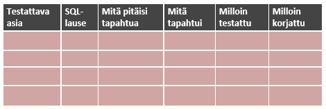

## Verkkokaupan tietokanta

Tehtävänäsi on suunnitella verkkokauppaa varten relaatiotietokanta, joka toteutetaan MySQL:llä tai PostgreSQL:llä. Sille tehdään myöhemmin JSON-rajapinta (*node.js*).

Tehtävästä syntyy pikkuhiljaa Wordilla tehty tietokantadokumentti (siis vain 1 tiedosto). Työ palautetaan github-classroomiin: tietokannat-repoon.

### Tietokannan suunnittelun vaiheet

#### ER-kaavio ja tietokantakaavio

1. Mieti ensin, mitä tietoja verkkokaupassa tarvitaan (pelkät tuotteet eivät riitä). Tee ER-kaavio suunnittelemasi tietokannan käsitteistöstä.

2. Tee tietokannan rakenteen kuvaus (Visio: Software/UML Database Notation). Muista lisätä myös tietotyypit jokaiselle kentälle.
 
3. Esittele suunnitelmasi opelle ja korjaa tarvittaessa ennen seuraavaan vaiheeseen siirtymistä.

#### SQL-toteutus

1. Luo taulukot SQL-tietokantaan. Tee luontilausekkeet (SHOW CREATE TABLE taulukon_nimi).

*Huom! Taulukot kannattaa nimetä niin, että jokaisen edessä on jokin sama tunniste, joka kertoo, että ne kuuluvat juuri tähän tietokantaan. (esimerkiksi "vk_asiakkaat")*
 
2. Luo yhteydet ja viite-eheydet (kun jokin tietue poistetaan, poistetaan samalla siihen kuuluvat tietueet toisesta taulusta). Tulosta (*export*) tietokannastasi luontilauseet vasta viite-eheyden lisäämisen jälkeen.

3. Syötä jonkin verran dataa tietokantaan.

#### Testitapaukset ja tietokannan testaaminen

Laaditaan yksinkertainen testauslomake ja siihen SQL-kyselyitä, joilla kokeillaan tietokannan käyttämistä. Pyri miettimään tyypillisiä käyttötapoja tietokannallesi. Tarkoitus on, että mukana on vähintään yksi SELECT, DELETE yms. -kysely. Kaikissa tauluissa ei tarvitse olla kaikkia tyyppejä mutta kaikkia tauluja tulisi testata jotenkin.

- Insert
- Delete Huom.! Viite-eheyden testaus
- Update
- Select
- Select useampaan taulukkoon

Suorita suunnittelemasi testit tietokannallesi, korjaa virheet.

## Verkkokaupan toiminnalliset vaatimukset

### Asiakas: 

- voi lukea tiedotteita
- voi selailla kaupan tuotteita ja tuoteryhmiä
- voi rekisteröityä
- voi tilata ja valita maksutavan
- voi seurata ostoskoriaan
- voi seurata teknisiä vaiheita ostoprosessissa (teknisillä vaiheilla tarkoitetaan rekisteröitymistä, tuotteiden keräämistä ostoskoriin ja tilauksen hyväksymistä)
- saa vahvistuksen kaupasta yhteystietoineen, peruuttamis- ja palauttamisohjeineen
- voi peruuttaa missä vaiheessa tahansa tilauksen
- voi antaa palautetta palautelomakkeella

### Lisäksi asiakas:

- voi lukea kuluttajansuojalain mukaiset yrityksen yhteystiedot (kuvitellussa yrityksessäkin on oltava merkittynä paikka, jossa rekisteritunnukset ovat)
- voi varmistaa, että henkilötietojen käsittely on tietosuojavaltuutetun ohjeiden mukaista – esimerkki lain vaatimat rekisteriselosteet
- voi lukea sopimusehdot ennen tilauksen hyväksymistä
- voi lukea kaupan peruuttamisohjeet

### Kaupan ylläpitäjä:

- voi lisätä, päivittää ja poistaa tuoteryhmiä ja tuotteita tuotetietoineen ja kuvineen (muista myös linkit valmistajan kotisivustolle)
- päivittää tiedotteita sivustolla
- hallinnoida (seurata, päivittää ja poistaa) tilauksia
- hallinnoida (seurata, päivittää ja poistaa) rekisteröityneitä asiakkaita
- lukea seurantaraportteja (esim. toteutuneista kaupoista jne.)
- lukea ja antaa vastauksia asiakaspalautteisiin